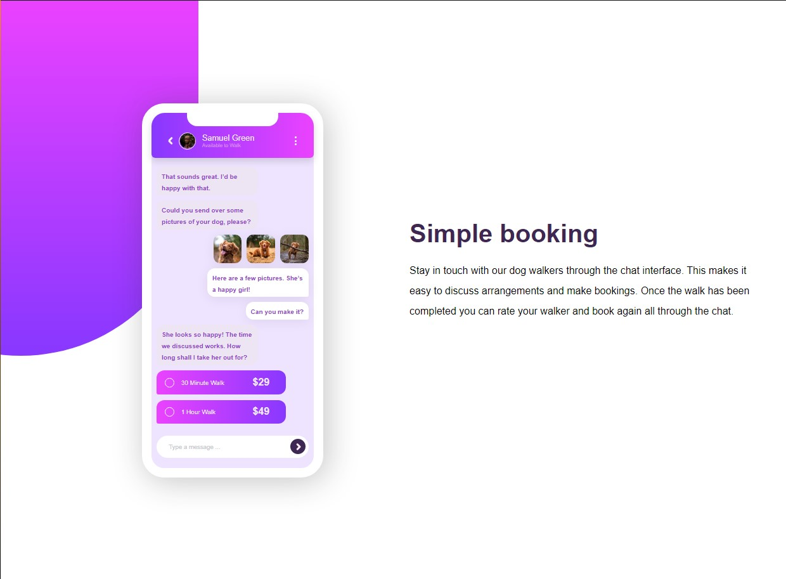

# Frontend Mentor - Chat app CSS illustration

## Welcome! 👋

Thanks for checking out this front-end coding challenge.

I just create this page use nothing but pure css and html without any framework. so I jsut stuck at one of the background shapes at the bottom right that you can see it in original design.       

I will very happy if you could just help me how to do this , Thanks!!

**Have fun!** 🚀
